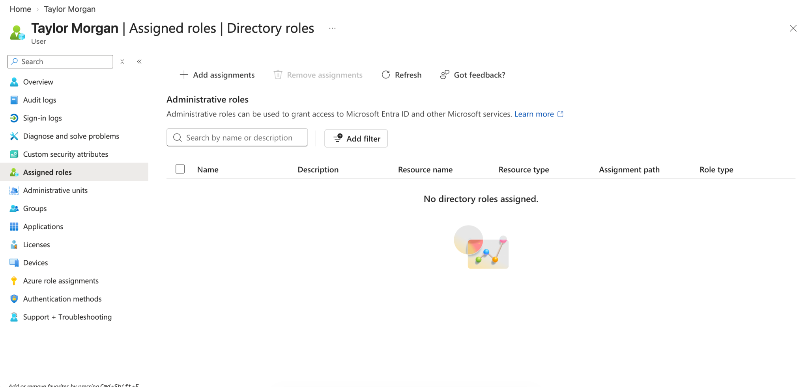
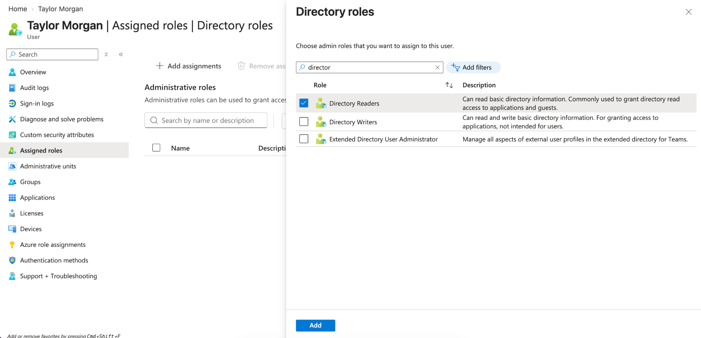
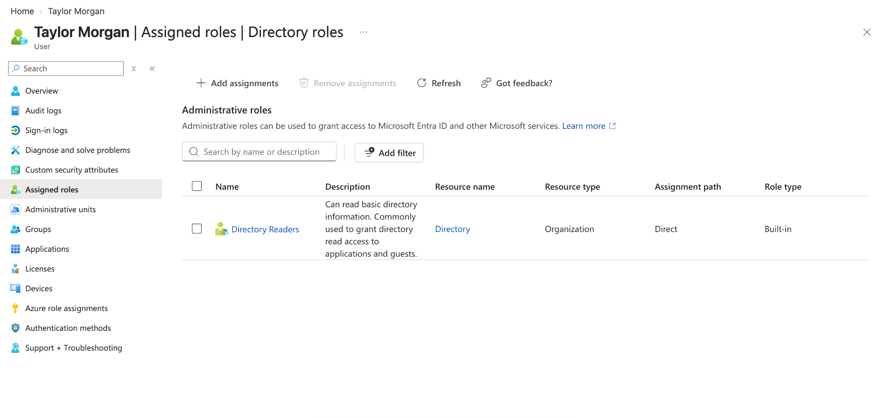

# Microsoft Entra ID Role Assignment

## Project Overview

In this lab, I practiced assigning a Microsoft Entra ID directory role to a cloud-based user account.

Building on my previous user provisioning and licensing labs, I used Microsoft Entra ID to review the user's current role assignments, select a built-in directory role, assign it directly to the user, and verify that the assignment was successful.

## Technologies Used

- Microsoft Entra ID
- Microsoft Azure
- Identity and Access Management (IAM)
- Role-Based Access Control (RBAC)

## What I Practiced

- Reviewing existing directory role assignments
- Identifying a user with no assigned directory roles
- Selecting a built-in Microsoft Entra directory role
- Assigning the role directly to a user
- Verifying the role assignment after completion
- Practicing least-privilege thinking when selecting permissions

## Step 1: Review Existing Role Assignments

I opened **Taylor Morgan's** account in Microsoft Entra ID and navigated to the **Assigned roles** section.

Before making any changes, I confirmed that the user had no directory roles assigned.

## Step 2: Select the Directory Readers Role

I selected **Directory Readers** from the available Microsoft Entra directory roles.

The Directory Readers role provides read access to basic directory information without granting broader administrative permissions.

For this lab, I chose a read-only role instead of a highly privileged administrative role so I could practice role assignment while following the principle of least privilege.

## Step 3: Verify the Role Assignment

After completing the assignment, I returned to the user's **Assigned roles** page and confirmed that **Directory Readers** was successfully assigned.

The assignment showed:

- **Role:** Directory Readers
- **Resource:** Directory
- **Resource Type:** Organization
- **Assignment Path:** Direct
- **Role Type:** Built-in

## Skills Practiced

- Microsoft Entra ID
- Identity and Access Management
- Role-Based Access Control
- Directory Role Assignment
- User Administration
- Least Privilege
- Access Verification
- Technical Documentation

## What I Learned

This lab helped me better understand the difference between creating a user, licensing a user, and assigning permissions to a user.

I learned how Microsoft Entra directory roles can be used to control what a user is allowed to access or manage within the environment.

I also gained more hands-on experience with the principle of least privilege by selecting a limited read-only role instead of granting more access than was necessary for the lab.
